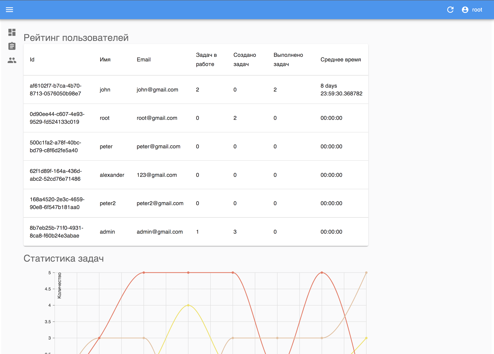
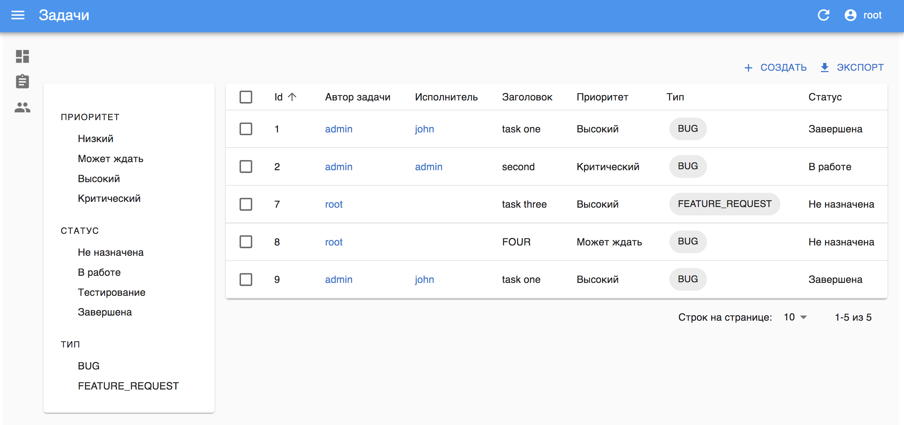

# Учим react быстро! Серия уроков

Всем привет!
Меня зовут Саша, я преподаю Java & JavaScript и занимаюсь backend разработкой. Я сделал этот курс, чтобы передать свой опыт обучения реакту на примере react-admin.

RA - это фреймворк, который работает на базе чистого react и предоставляет набор готовых шаблонов и макетов, на основе которых можно быстро создать сложные SPA (Single Page Application) приложения, не имея большого опыта во frontend разработке.
Для обучения вам понадобится базовый уровень владения JavaScript ES6 или TypeScript, редактор кода Visual Studio Code & Google Chrome

Вот так выглядит проект, который я собрал практически без опыта работы с реактом за две недели

## 1️⃣ Урок первый

### Подготовка среды

React-admin работает поверх чистого реакта, поэтому, вам понадобится:

1. Интерпретатор JavaScript — **node.js** (я использовал версию 14.19.1)
2. Пакетный менеджер **yarn**
3. Проектный менеджер реакта **create-react-app**

### Установка

Скачать установщик node.js для [windows](https://nodejs.org/download/release/v14.19.1/node-v14.19.1-x64.msi). Если у вас другая система, найдите нужный установщик [здесь](https://nodejs.org/download/release/v14.19.1/).

Далее нужно установить пакетный менеджер. Откройте терминал (Зажать кнопки Win+R, ввести cmd, нажать Enter)
И введите команду — `npm i -g yarn`

Установить проектный менеджер реакта — `yarn global add create-react-app`

Если с установкой проекта не возникло проблем - переходите на [Урок 2](./docs/lesson2/index.md)

Задать вопросы можно в [группе](https://t.me/learn_you_react_admin/10) в телеграмме
