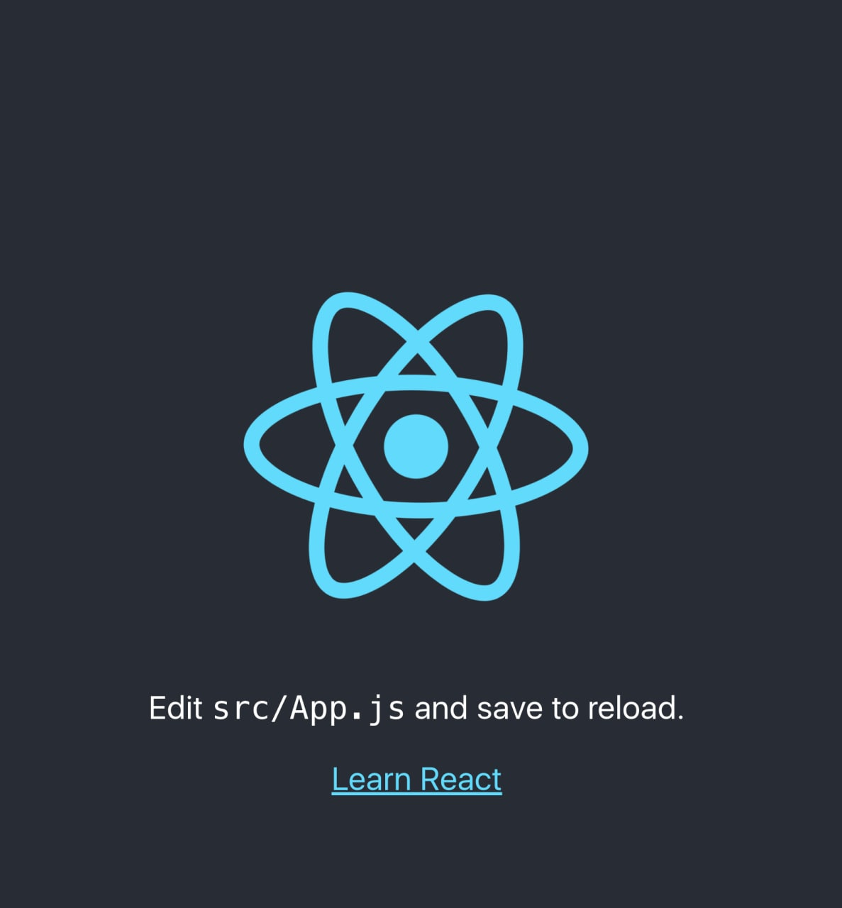

# 2️⃣ Урок второй

Пришла пора сделать проект

Откройте терминал, если он закрыт, и перейдите в папку, где вы хотите сделать проект. У меня это папка education. Чтобы в нее перейти, введите команду `cd education/`. Ошибок быть не должно, если папка есть на диске.

Теперь можно сделать сам проект командой `create-react-app ra-stepbystep`. Она может выполняться довольно долго, это нормально.

После завершения нужно зайти в папку с проектом: `cd ra-stepbystep` и запустить его командой `yarn start`. Через какое-то время у вас откроется окно браузера с вашим проектом.

Вот, что получилось

Если вы увидели страницу как на скриншоте - переходите в [Урок 3](../lesson3/index.md)

Задать вопросы можно в [группе](https://t.me/learn_you_react_admin/7) в телеграмме
