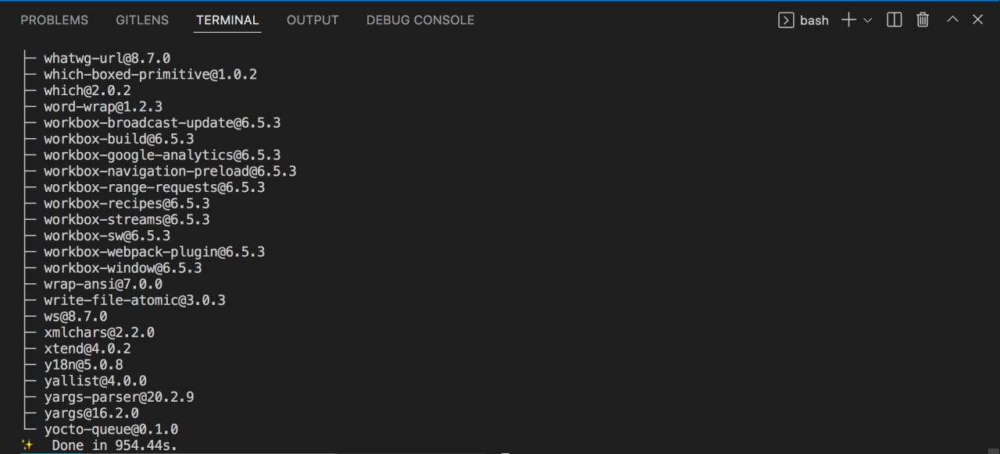

# 3️⃣ Урок третий

Начинается самое сложное — установка react-admin.

Пока что у нас только голый реакт. Чтобы продолжить, нам нужны умные компоненты, с помощью которых можно отображать списки, создавать и удалять записи, фильтровать выборку и роутер, который будет отвечает за переходы между страницами.
Самостоятельно это писать займет много времени и сил, поэтому я выбрал **react-admin**, в котором есть богатый набор качественных компонентов, с подробной документацией. Все это позволяет быстро разработать простой и качественный интерфейс, которым легко пользоваться.

Итак, чтобы установить react-admin и его зависимости, выполните команду `yarn add react-admin ra-data-json-server prop-types` внутри папки с проектом. Она выполняется еще дольше, это нормально

Если все ок, следующий [Урок 4](../lesson4/index.md)

Задать вопросы можно в [группе](https://t.me/learn_you_react_admin/11) в телеграмме
