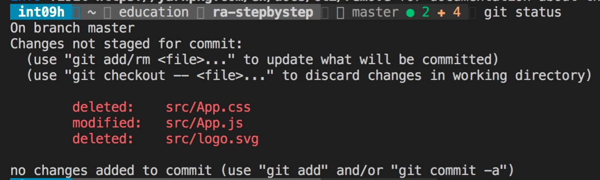
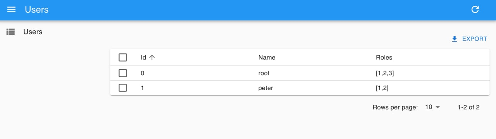

# 4️⃣ Урок четвёртый

Теперь можно удалить все лишние файлы в папке src, сгенерированные по-умолчанию:

Я удалил файлы src/App.css & src/logo.svg

## Шаг второй

В файле с главным компонентом — App.js уберем все и напишем новые импорты:

```js
import * as React from "react";
import { Admin, ListGuesser, Resource } from "react-admin";
import fakeDataProvider from "ra-data-fakerest";
```

## Шаг третий

React-admin умеет отрисовывать данные, которые приходят от backend-а. У нас его нет, поэтому я создал данные, с которыми буду работать:

```js
const dataProvider = fakeDataProvider({
  users: [
    { id: 0, name: "root", roles: [1, 2, 3] },
    { id: 1, name: "peter", roles: [1, 2] },
  ],
  roles: [
    { id: 1, name: "DEVELOPER" },
    { id: 2, name: "MODERATOR" },
    { id: 3, name: "ADMIN" },
  ],
});
```

И последнее, сам компонент, который будет отвечать за отрисовку интерфейса:

```js
const App = () => (
  <Admin dataProvider={dataProvider}>
    <Resource name="users" list={ListGuesser} />
  </Admin>
);

export default App;
```

Теперь можно запускать — `yarn start`
Скорее всего, вы получите ошибку, потому что не хватает зависимости `ra-data-fakerest`, которую также нужно установить запустив команду `yarn add ra-data-fakerest` внутри папки с проектом

Если у вас браузер не сафари, тогда вы увидите такую страничку:


[Пятый урок](./docs/lesson5/index.md)

Задать вопросы можно в [группе](https://t.me/learn_you_react_admin/16) в телеграмме
