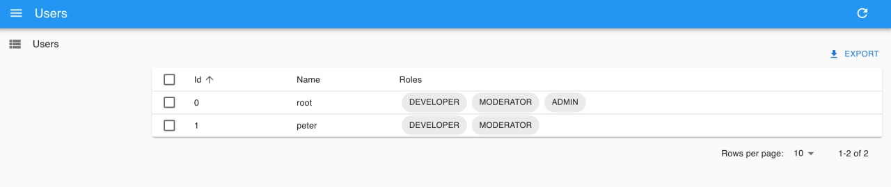
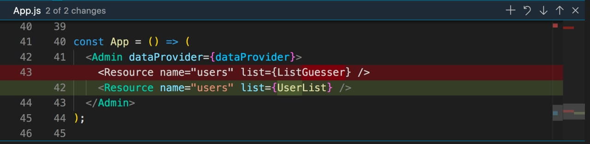

# 5️⃣ Урок пятый

Ну что, я обещал, что будет быстро? На создание подобного приложения без react-admin ушло бы больше времени и сил. А самое главное, оно было бы сложнее. Давайте рассмотрим получившийся код.

```jsx
const App = () => (
  <Admin dataProvider={dataProvider}>
    <Resource name="users" list={ListGuesser} />
  </Admin>
);
```

У нас есть корневой компонент `<Admin />`, который отвечает за всю магию: загружает необходимые данные, отрисовывает navbar и меню навигации справа, создает виртуальный роутер, для перехода между страницами просмотра, создания, редактирования записей и много другого. Внутри него мы объявляем ресурс `<Resource />` который уже работает с backend-ом, загружая данные из endpoint-а /users (это настраивается в свойстве name) и предоставляет функционал списка с пагинацией.
Если нам понадобится отобразить еще что-то, мы можем создать новый ресурс и справа появится ссылка на него.

Отлично, что дальше? У наших пользователей есть роли, но ссылки на них заданы через ключи id (внутри dataProvider массив roles), поэтому в списке отображается перечисление ролей через запятую, просто цифры. Именно так данные хранятся в настоящем backend-е, в реляционных базах данных. Это совсем не информативно. Логичнее было бы отобразить список имен ролей для каждого пользователя. Для этого, нам нужно сопоставить каждый идентификатор (id) у пользователя с каждой ролью. Это отношение один ко многим, которое задается в react-admin с помощью компонента `<ReferenceArrayField />`

Перед тем, как его использовать, нам нужно реализовать свой список пользователей, тк сейчас он создается автоматически, исходя из существующих полей. Это хорошо подходит для разработки и тестирования, но не всегда после автоматического создания компонента будут работать отношения между сущностями (редко когда). Поэтому, чтобы задать отношение вручную, я сделал такой компонент:

```jsx
const UserList = () => (
  <List>
    <Datagrid>
      <TextField source="id" />
      <TextField source="name" />
      <ReferenceArrayField source="roles" reference="roles">
        <SingleFieldList linkType={false}>
          <ChipField source="name" />
        </SingleFieldList>
      </ReferenceArrayField>
    </Datagrid>
  </List>
);
```

Рассмотрим подробнее. На самом верхнем уровне компонент `<List />`, именно от отвечает за загрузку данных, пагинацию, фильтрацию и предоставление контекста для внутристоящих компонентов. Но сам по себе лист ничего не отображает. Эту роль выполняет компонент `<Datagrid />`, который рисует таблицу и все необходимые элементы управления: кнопку экcпорт, управление количеством елементов на странице, групповое выделение, создание и удаление. Но таблица все еще пустая. Чтобы отобразить поля, которые есть у пользователей, я использую компоненты:

```jsx
<TextField />
<ReferenceArrayField />
<SingleFieldList />
<ChipField />
```

Посмотрите, стало гораздо лучше:


Чтобы все работало, не забудте обновить импорты react-admin:

```js
import {
  Admin,
  Resource,
  List,
  Datagrid,
  TextField,
  ReferenceArrayField,
  SingleFieldList,
  ChipField,
} from "react-admin";
```

А также, указать в ресурсе пользователей, для свойства list использовать новый компонент:



[Шестой урок](./docs/lesson4/index.md)

Задать вопросы можно в [группе](https://t.me/learn_you_react_admin/18) в телеграмме
