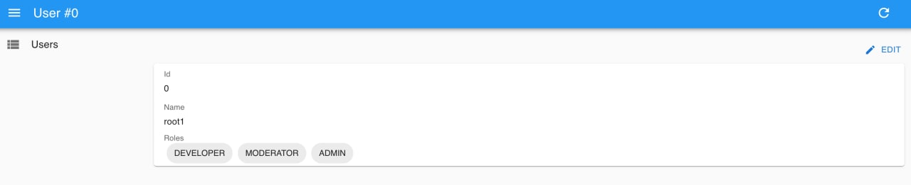
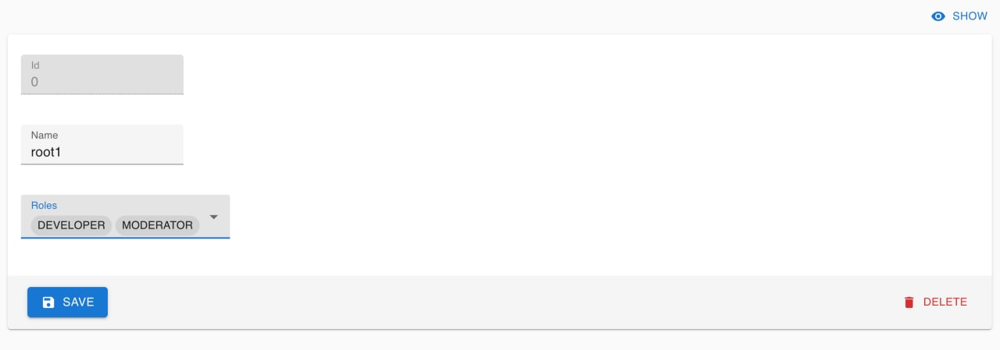

# 6️⃣ Урок шестой

## Создание и удаление записей

У нас уже есть список, но кроме отображения данных frontend приложения ещё отвечают за создание, редактирование и удаление (**CRUD**). Давайте же сегодня добавим такую возможность в нашу админ панель.

Есть два способа, как это можно сделать, лёгкий и более сложный.

В предыдущем уроке я упоминал компонент `<ListGuesser />`, который умеет автоматически создавать компоненты, основываясь на данных. В react-admin также есть компоненты `<ShowGuesser />`, `<EditGuesser />` для отображения и редактирования соответсвенно. 

Второй способ — сделать компоненты вручную. Тк я хочу, чтобы роли отображались правильно, я сделаю свою компоненты, тем более, что это будет не очень сложно, тк они будут почти идентичны компоненту `<UserList />`.

### 💡Просмотр карточки пользователя

Компонент `<UserShow />`, вот его реализация:

```js
const UserShow = () => (
  <Show>
    <SimpleShowLayout>
      <TextField source="id" />
      <TextField source="name" />
      <ReferenceArrayField source="roles" reference="roles">
        <SingleFieldList linkType={false}>
          <ChipField source="name" />
        </SingleFieldList>
      </ReferenceArrayField>
    </SimpleShowLayout>
  </Show>
);
```

Тк это карточка пользователя, нужно отобразить не список, а только набор полей id, name, roles, для чего я использую `<TextField />` & `<ReferenceArrayField />`. Те же компоненты, что и в листе, только здесь вместо `<List>` и `<Datagrid>` я использовал `<Show>` & `<SimpleShowLayout>`. Эти компоненты необходимы для правильного отображения карточки и ее позиционировании на странице. 

### 💡Редактирование пользователя

```js
const UserEdit = () => (
  <Edit>
    <SimpleForm>
      <TextInput disabled source="id" />
      <TextInput disabled source="name" />
      <ReferenceArrayInput source="roles" reference="roles">
        <SelectArrayInput optionText="name" />
      </ReferenceArrayInput>
    </SimpleForm>
  </Edit>
);
```

Форма редактирования отличается чуть больше. Также, как и в случае с `<UserShow>` меняются корневые компоненты, теперь это `<Edit>` и `<SimpleForm>`. 
Доступны для редактирования будут поля name и roles, поэтому я добавил в форму `<TextInput />` & `<ReferenceArrayInput />`. Поле id не должно меняться, поэтому его поле ввода помечено как disabled.

Осталось добавить импорты и подключить наши новые компоненты к `<Resource />` пользователей:

```js
import {
  Admin,
  Resource,
  List,
  Datagrid,
  TextField,
  ReferenceArrayField,
  SingleFieldList,
  ChipField,
  Show,
  SimpleShowLayout,
  Edit,
  SimpleForm,
  TextInput,
  ReferenceArrayInput,
  SelectArrayInput,
  EditButton,
} from "react-admin";
...
<Resource name="users" list={UserList} show={UserShow} edit={UserEdit} />
```

Форма отображения пользователя:

Форма редактирования пользователя:

Посмотрите, что получилось! Практически бесплатно мы получили карточку просмотра пользователя, форму редактирования, а еще возможность удалять пользователей, не написав ни одного хука, обработчика нажатия и HTTP запроса — react-admin делает это автоматически
Разве не круто? 😱

Форму создания оставляю на домашнее задание
Используйте компоненты `<Create>` & `<SimpleForm>`
Если возникнут трудности [здесь](https://marmelab.com/react-admin/Create.html) можно посмотреть реализацию.

Задать вопросы можно в [группе](https://t.me/learn_you_react_admin/21) в телеграмме
